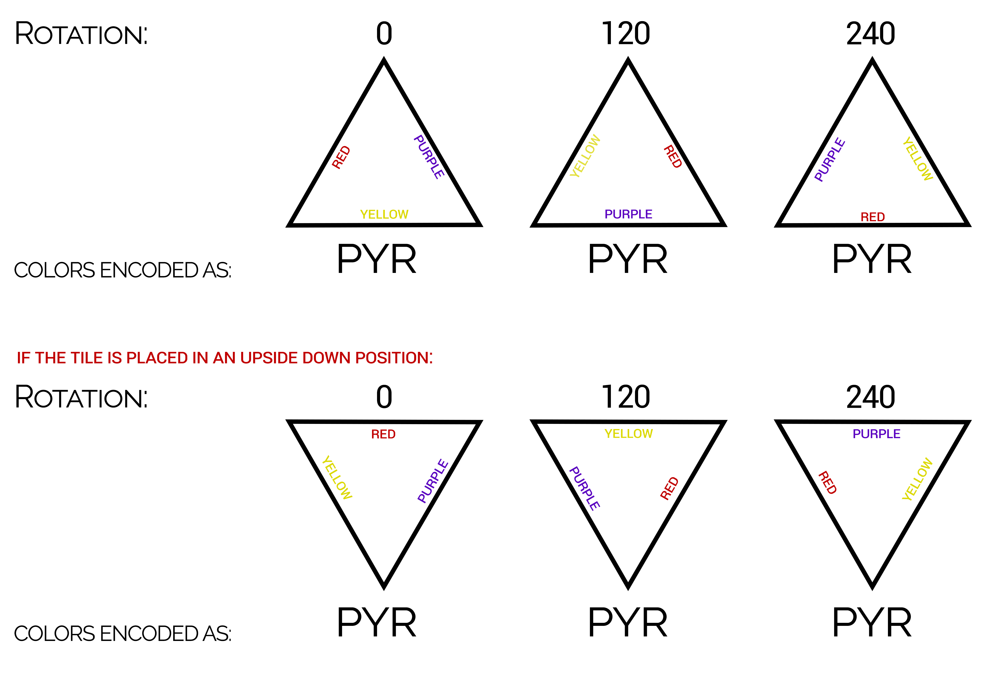
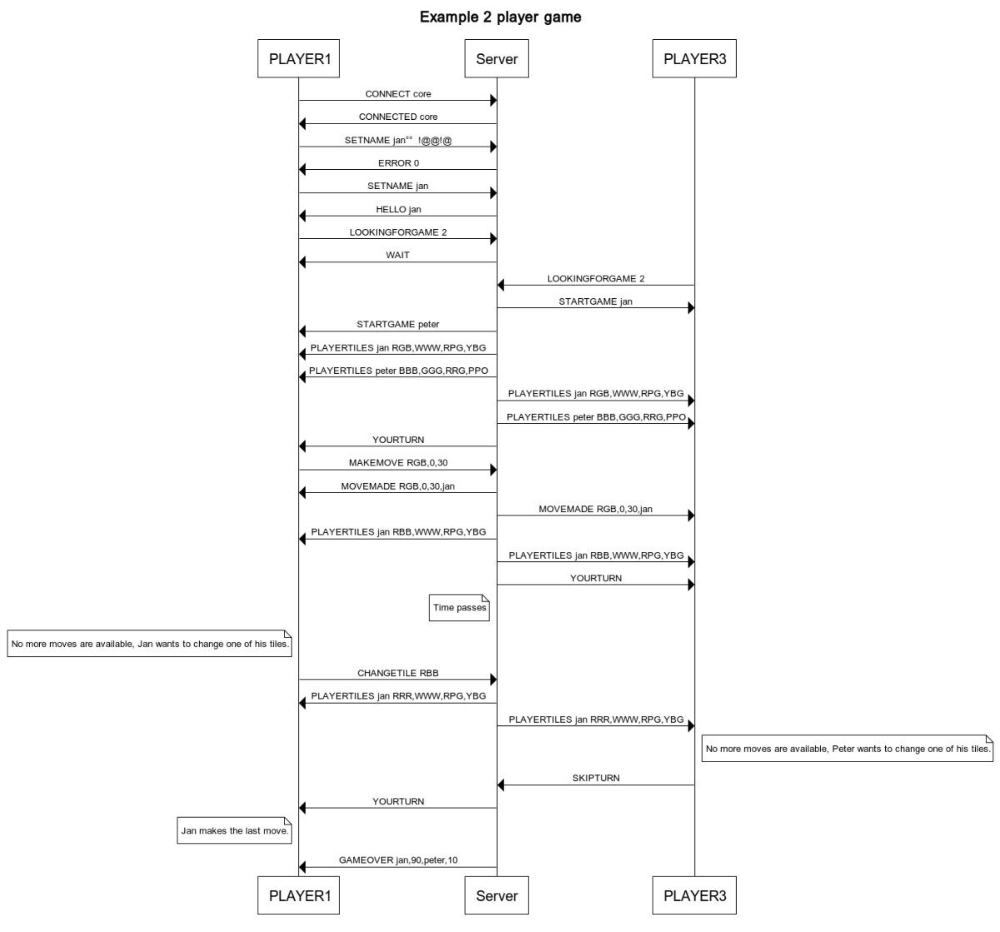

Protocol CS1/CS2 (v3.6)
==

Current version: 3.6
**PLEASE NOTE THAT THERE HAS BEEN A CHANGE TO THE CORE PROTOCOL AGAIN AGAIN** 

If anything is changed, the version number will be incremented. Please write this version number down, so you know whether your server/client supports everything. All changes will be noted within the changelog:

    CHANGES V3.6: 
    	made a mistanke at getchatplayers. Wrong argument.
    CHANGES V3.5:
    	As the order of turns was unclear, a minor change has been made to the STARTGAME command. The STARTGAME will now also list the player's own name. Which makes it easier to see what the order of turns will be. Turns go clockwise from player1 -> player2 -> player3 -> player4 -> player1. (if player1 is the starting player.). The starting player will be determined using the rules provided on canvas.
		The GETCHATPLAYERS command has been added for the chat protocol.
		A clarification about the TileBag was added beneath the rotation/color encoding section.
	
	
    CHANGES V3.0:
    	The YOURTURN command has been changed to playerturn with a name. This allows for the client and server to have the same state of the game.
    CHANGES V2.0:
	    The rotation diagram has been updated, to properly reflect what we decided upon during the protocol session. 
	    
	    Challenge protocol: server->client
		    The DENIED and REVOKED command has been changed to reflect the fact that a challenger can only have one outgoing challenge request at a time.
		    The description for the CHALLENGED command has been changed, to show the names of everyone in a proposed game. (to make it simpler)
	    
	    Challenge protocol: client->server
		    The description for the CHALLENGE command has been changed.
		    The behaviour for denying a challenge has been determined and reflected in the challenge protocol descriptions appropriately.
		    REVOKE no longer requires the names of the players that were challenged, as there can only be one outgoing challenge.
	    
	    Security protocol:
		    A salt commmand has been added
		    The login and password command has been splitted into two commands
		    
	    The WIP titles have been removed.
	    
	    Error codes:
		    Several additional error codes have been added: 12 - 16
		


If anything is unclear about the protocol, feel free to ask me, or reach out to me via email (j.r.vanbommel@student.utwente.nl).


General information
===


**In the protocol session we assumed there would only be two players playing a game, this is (unfortunately) not true. The player can choose to play with up to 4 persons. As a result of this the commands have been changed accordingly.**

If there are arguments which are defined between `<>`, these might be possible arguments. Anything between `()` is added to quickly clarify what arguments are, this should **not** be included in your protocol.

**EXAMPLE**: 

| Command | Arguments |  
| -------- | -------- |
|`CONNECT`|`(supported:) <core,chat,challenge,leaderboard,security>` |

The line above means that the client could (for example) send one of the below: 
 - `CONNECT` (which is not valid in our protocol.)
 - `CONNECT core`
 -  `CONNECT core,chat`
 - `CONNECT core,chat,challenge`
 - `CONNECT core,leaderboard`
 - `CONNECT core,chat,challenge,leaderboard`
 - `CONNECT core,chat,challenge,leaderboard,security`


Between CONNECT and the first argument is a space character (ASCII 0x20).  The arguments that follow are comma seperated. Between different parameters is never a space. (NO `core, chat,     challenge,  aaaa`)

Color and rotation encoding
===


**It has been unclear which tiles the TileBag should contain. You should follow the rules as they are provided on canvas.**

   	 • All red, all blue, all green, all yellow, all purple (6 points each).
	• 2 x red and yellow, 2 x red and purple, 2 x blue and red, 2 x blue and purple, 2 x green
	and red, 2 x green and blue, 2 x yellow and green, 2 x yellow and blue, 2 x purple and
	yellow, 2x purple and green (5 points each)
	• 2 x red and blue, 2 x red and green, 2 x blue and green, 2 x blue and yellow, 2 x green
	and yellow, 2 x green and purple, 2 x yellow and red, 2 x yellow and purple, 2 x
	purple and red, 2 x purple and blue (4 points each).
	• [yellow, blue, purple], [red, green, yellow], [blue, green, purple], [green, red, blue] (3
	points each)
	• [blue, red, purple], [yellow, purple, red], [yellow, purple, green] (2 points each)
	• [green, red, purple], [blue, yellow, green], [red, yellow, blue] (1 point each)
	• All white (joker, 1 point)
	
Which means that the only valid tiles in the system are: 

   	RRR, BBB,GGG,YYY,PPP,RRY,RRP,BBR,BBP,GGR,GGB,YYG,YYB,PPY,PPG,RRB,RRG,BBG,BBY,GGY,GGP,YYR,YYP,PPR,PPB,YBP,RGY,BGP,GRB,BRP,YPR,YPG,GRP,BYG,RYB,WWW.

Core Protocol: Client
===
These are messages which are sent by the client to the server. The server should handle these incoming messages.

| Command | Arguments | Description | 
| -------- | -------- | -------- |
|`CONNECT`|`(supported:) <core,chat,challenge,leaderboard,security>` | The client sends this to the server to initiate a connection. The arguments let the server know what extra functions are implemented in the client. Everyone should at least send `CONNECT core`, as everyone has the core protocol implemented. Upon receiving this command the server should respond with the `CONNECTED` command.|
|`SETNAME`|`name` | The name that the player wants the server to store and use. This name is then re-used in the `STARTGAME` command send by the server, to let the opponent know against which player the player is playing. The server should respond by sending `HELLO` or `ERROR`. |
|`LOOKINGFORGAME`| `(amount of players:) <2,3,4>` | This is sent once the player wants to play a game, the client announces that the player is looking to play a game. The argument describes the amount of players the game should have, which can be an integer from 2 to 4. The server will then select opponent(s) which are also looking to play a game, and match them. The server should respond by either telling the client to `WAIT` or that a game was found (`STARTGAME`).|
|`MAKEMOVE`| `(tile colors:) RGB, (rotation:) <0,120,240>, (fieldindex:) <0-35>` | The player has made a move in the game and announces this to the server. The first argument (`RGB`) describes which tile was placed. The second argument is the rotation of the tile. The third argument is a number from 0 to 35, which describes on which fieldindex the tile was placed. The server acknowledges this move by sending the `MOVEMADE` command to both the player and the opponents. If the move is invalid an `ERROR` should be send (see errors table).  |
|`CHANGETILE`| `(tile colors:) RGB` | The player was not able to make a move and can choose between missing a turn or exchanging one of the tiles for a new one and passing the turn. This command tells the server that the player decided to exchange one of their tiles. The argument describes the colors of the tiles that were exchanged. The server responds by sending a `PLAYERTILES` to the player and the opponents.  |
|`SKIPTURN`|  | The player was not able to make a move and chose to miss a turn. The server should respond by sending a `PLAYERTURN` command. |
|`DISCONNECT`|  | The player has disconnected from the server, this should also be sent if the application was killed for example by ALT-F4. If the player was playing a game, the server should tell the opponents the disconnect happened with an `ERROR`. |


Core Protocol: Server
===
These are messages which are sent by the server to the client. Your client should handle these incoming messages.

| Command | Arguments | Description |
| -------- | -------- | -------- |
|`CONNECTED`|`(supported by server:)<core,chat,challenge,leaderboard,security>`| A player has succesfully connected to the server. If anything happens, which would mean that a connection would not be succesful (e.g. the client does not tell the server that it understands the core protocol) the server should send an `ERROR`. |
|`ERROR`|`error_code`| If an error happens the server should send this to the client. The error codes are described below. |
|`HELLO`|`name ` |A player has set their name succesfully. We acknowledge this by sending `HELLO` followed by the name. Make sure to check for any invalid characters in names, such as a comma (which will introduce bugs in commands where the player name is used. *-thanks to Jurre for this addition*)|
|`WAIT`||Once a player has announced that they are looking for a game, the server tells the client that they should wait for a game to be available. Once a game is found, the `STARTGAME` command is sent by the server.|
|`STARTGAME`|`(names: ) player1,player2,<player3,player4> ` |A game is found. The arguments are the names of the opponents and the player's own name. This order is used to determine the next player that can make a turn (e.g. player2->player3->player4->player1->player2).|
|`PLAYERTILES`|`(player name:) player, (tiles:) RGB,<RGB,RGB,RGB>` |The tiles that the player posesses. This can be 4 tiles or less: at the end of the game there are no more tiles to grab from the bag.|
|`PLAYERTURN`| `(player name:) player`|All players receive this command. The player that matches the name in the argument may make the next move. It is their turn to play.|
|`MOVEMADE`|`(tile colors:) RGB, (rotation:) <0,120,240>, (fieldindex:) <0-35>, (player name:) name` |Acknowledges that a move was made succesfully and broadcasts that to other players in the game. The name of the player that made the move is appended to the end.|
|`GAMEOVER`|`(name:) name,(points:) integer, (name:) name, (points:) integer, <..>` |The game has ended. The name of each player is sent, after that a comma and then the amount of points that player has gotten. This is not sorted. |

Example of a game:



Error codes
---------
```
CORE:
0  Username is invalid or in use
1  Connection is refused (for some reason)
2  You tried to make a move, but it wasn't your turn yet
3  The move you made was invalid, for example because the field is already used.
4  Opponent disconnected during the game.
5  Invalid command received (generic error).

CHAT:
10 Invalid chat message, not correctly encoded.

LOGIN:
11 Incorrect password.
12 Name does not exist.

CHALLENGE PROTOCOL:
13 Challenge is revoked. (and thus you can't accept or deny)
14 You have already challenged someone, you need to revoke the challenge to them first.
15 A player you tried to challenge does not exist.
16 You tried revoking a challenge, without challenging someone.
```


Chat Protocol
===

The following are messages which are sent by the **server to the client**. Your client should handle these incoming messages if you wish to implement the Chat Box extension.

| Command | Arguments | Description |
| -------- | -------- | -------- |
|`INCOMINGMESSAGE`|`(message:)dGVzdA==,(from:)name`|A message has been sent to the player, this message is Base64 encoded. (Example: `test` -> `dGVzdA==`). The server checks whether this message was correctly encoded by decoding it once (and seeing if that results in errors). If it is incorrect it should give an `ERROR`. The name of the player that sent the message is appended to the end.|
|`CHATPLAYERS`|`names`|The names of the players in the game that support chat.   |

The following are messages which are sent by the **client to the server**. 

| Command | Arguments | Description |
| -------- | -------- | -------- |
|`SENDMESSAGE`|`(message:)dGVzdA==,<(to:)name>`|A player wants to send a chat message to all players that are currently in the game. If this is the case, no name has to be specified. If the player wants to send a message specifically to one person, the name of that player has to be specified.   |
|`GETCHATPLAYERS`||Will return the names of the players in the game that support chat.   |

Challenge Protocol
===

The following are messages which are sent by the **server to the client**. Your client should handle these incoming messages if you wish to implement the Challenge extension.

|Command|Arguments|Description|
|--------|--------|--------|
|`LOBBYPLAYERS`|`<name,name,name,...>`|The names of the players that are in the lobby.|
|`CHALLENGED`|`(challenger:)name, <(player1:)name,(player2:)name>`|The player has been challenged by the challenger. The arguments are the names of everyone in the proposed game, except the challenger (as he is already the first argument). |
|`DENIED`|`(challenger:)name, (denier:)name`|The player does not want to play a game, |
|`REVOKED`|`(challenger:)name`|The challenger has revoked the challenge. A player can thus no longer accept or deny that challenge.|


The following are messages which are sent by the **client to the server**. 

| Command | Arguments | Description |
| -------- | -------- | -------- |
|`LEAVELOBBY`||A player wants to leave the lobby. All challenges from the player will be revoked. (it is up to you if you decide this should also  mean that the player is `LOOKINGFORGAME`).  |
|`JOINLOBBY`||A player wants to join a lobby, the player is no longer `LOOKINGFORGAME`. Once the player has joined the server, they will be updated on the players that are also in the lobby. They can then challenge these players.  |
|`CHALLENGE`|`(player1:)name, <(player2:)name,(player3:)name>`|A player wants to challenge another specific set of players in the lobby to play a game with. (maximum of 3 other people that you can play with) A challenge can be revoked by sending `REVOKE`. A player can only have **one** outgoing challenge at a time. If the player wants to challenge someone else, they should `REVOKE` their challenge first. If that does not happen, the server should send an `ERROR`|
|`ACCEPT`|`(challenger:)name`|The player accepts the challenge to play with the other players. The argument is the name of the player that has sent the challenge request. If the player joins a game, they should be removed from the lobby. If a player accepts or denies a request which is already revoked, they will get an `ERROR`. |
|`DENY`|`(challenger:)name`|The player denies the challenge to play with the other players. The argument is the name of the player that has sent the challenge request. If multiple players are challenged, and one of them denies, the server should send the `DENIED` message to everyone. The challenge is then denied for everyone. If a player accepts or denies a request which is already revoked, they will get an `ERROR`.|
|`REVOKE`||The player revokes the current challenge to play with the other players. If a player does not have an outgoing challenge request, they will get an `ERROR`. |


*Note:* if multiple players are challenged and one of them accepts, but while waiting for others to accept, he decides that he does not want to play, he can still send the deny message. The game will then be denied for everyone. 

Leaderboard Protocol
===

The following are messages which are sent by the **server to the client**. Your client should handle these incoming messages if you wish to implement the Leaderboard extension.

| Command | Arguments | Description |
| -------- | -------- | -------- |
|`LEADERBOARD`|`BASE64(name,score,datetime),<BASE64(name,score,datetime)>,...`|An entry of the requested leaderboard. Each entry is Base64 encoded. The encoded entries are comma seperated. The datetime is a UNIX timestamp. If the player has requested a daily average, the name may be `Daily Average` and the datetime could be the current datetime, as this information is not relevant.|

The following are messages which are sent by the **client to the server**. 

| Command | Arguments | Description |
| -------- | -------- | -------- |
|`GETLEADERBOARD`|`<[top,000] [above,000,000] [below,000,000] [avgscore] [dailyavg] [dailybest]>`|Request information  from the leaderboard.

 - `top,5` will return the top 5 best scores
 - `above,5000,2` will return the 2 scores above 5000 points
 - `below,1000,3` will return the 3 scores below 1000 points.
 - `avgscore` will return the average score over all games
 - `dailyavg` will return the average score over all games on that day
 - `dailybest` will return the best score over all games of that day
   
   
Security Protocol
===

The following are messages which are sent by the **server to the client**. Your client should handle these incoming messages if you wish to implement the Security extension.

| Command | Arguments | Description |
| -------- | -------- | -------- |
|`LOGINVALID`||If the password was correct, otherwise an `ERROR` is sent.|
|`SALT`|`salt`|A random generated string of letters and/or numbers. To be determined by you. Can be anything from `apple`,`iLoveApple` to `PCsAreTh3B35t`. The salt's length has to be 7-15 characters. |

The following are messages which are sent by the **client to the server**. 

| Command | Arguments | Description |
| -------- | -------- | -------- |
|`LOGIN`|`name`|The username of the player that wants to log in. Server will respond with a `SALT`
|`PASSWORD`|`password`|Password is encrypted with SHA256 with UTF8 as the charset. Appended after that string will be the salt from the `SALT` command. That will then be encrypted again with SHA256. The resulting bytes are then encoded using Base64. This resembles the password. To summarise: `BASE64(SHA256(SHA256(plaintext_password)+salt))` 

The server only has to store the result of `SHA256(plaintext_password)`, as this is more secure than storing plaintext passwords.

**yes this would not be secure enough for a large game, but it is more than sufficient for a game of this scale**
